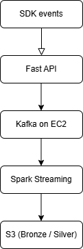
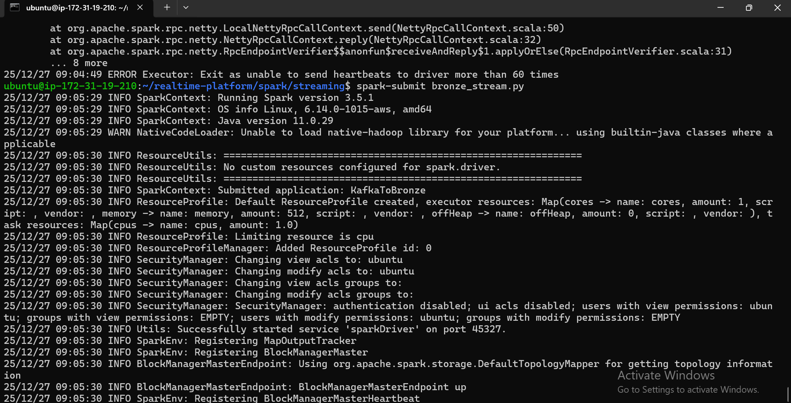
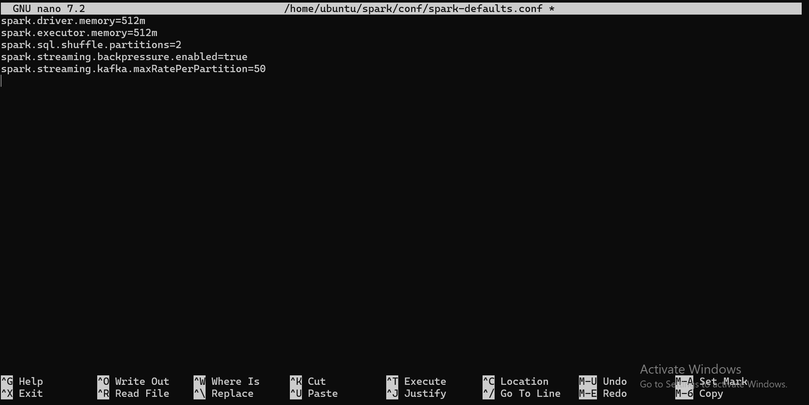

# Real-Time Event Data Platform

A production-grade real-time event data platform built using **Kafka**, **Spark Structured Streaming**, and **AWS S3**, designed to ingest high-volume product events, support experimentation (A/B testing), and enable reliable real-time and batch analytics.

---

## Problem Statement

Modern product companies generate massive volumes of user and system events (page views, feature exposure, conversions, etc.).

Traditional batch ETL or BI-centric pipelines struggle with:
- Real-time ingestion at scale
- Late-arriving events
- Exactly-once processing guarantees
- Replay and backfills
- Experimentation correctness

This project demonstrates how to design and build a **production-style event data platform** that solves these problems.

---

## 🏗️ High-Level Architecture

### Core Principles
- **Decoupled producers and consumers**
- **Event-time processing**
- **Exactly-once semantics**
- **Replayable & backfillable pipelines**
- **Cloud-native, low-cost architecture**

---

## 📦 Platform Components

### 1. SDK (Producer Contract)
- Provides a clean interface for applications to emit events
- Enforces schema consistency and validation
- Hides platform complexity from application teams

### 2. Ingestion API (FastAPI)
- Secure and controlled entry point into the platform
- Validates incoming events
- Publishes events asynchronously to Kafka
- Decouples applications from Kafka internals

### 3. Kafka (Event Backbone)
- Acts as the durable, ordered event log
- Enables replay, backfills, and downstream decoupling
- Single-node setup for development (free-tier friendly)

### 4. Spark Structured Streaming
- Consumes events from Kafka
- Uses event-time semantics and watermarking
- Ensures exactly-once processing
- Writes data incrementally to S3

### 5. S3 Data Lake (Bronze & Silver)
- **Bronze**: Immutable raw event storage (system of record)
- **Silver**: Cleaned, validated, experiment-aware datasets ready for analytics

---

## 🥉 Bronze Layer (Raw Events)
The Bronze layer stores immutable, append-only raw events ingested from Kafka:

- Preserves original event payloads
- Acts as the system of record
- Enables replay, backfills, and audits
- Contains no business logic or filtering

## 🥈 Silver Layer (Business-Ready Events)
The Silver layer applies domain-specific transformations on top of raw Bronze events:

- Filters valid event types
- Normalizes timestamps
- Adds experiment semantics
- Produces analytics-ready datasets
- Remains fully replayable from Bronze

This ensures downstream consumers do not duplicate business logic.

---

## 🔐 Engineering Guarantees

- Exactly-once event processing
- Idempotent ingestion using `event_id`
- Event-time processing with late data handling
- Checkpointing for fault tolerance
- Replay and backfill support from Bronze data

---

## 🚀 How to Run (High Level)

- Kafka and Spark run on AWS EC2 (free tier compatible)
- Spark writes data to AWS S3
- SDK runs locally to simulate real application traffic
- Ingestion API runs as a standalone service

Detailed operational steps are documented in `RUNBOOK.md`.

---

Below are screenshots demonstrating the platform running end-to-end in a real environment.

### Kafka & Zookeeper Running

### Spark Structured Streaming (Bronze & Silver)

### Spark configuration

### SDK Producing Events

---

## 🛣️ Future Work

- Gold layer aggregations
- Batch backfills and reprocessing jobs
- Failure simulations and recovery scenarios
- Observability and monitoring

